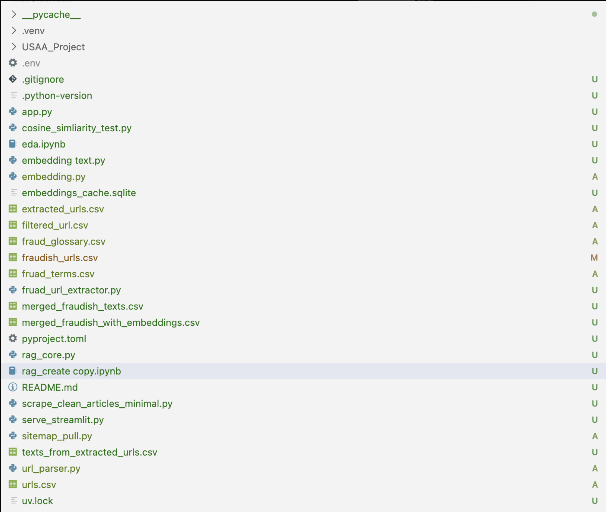
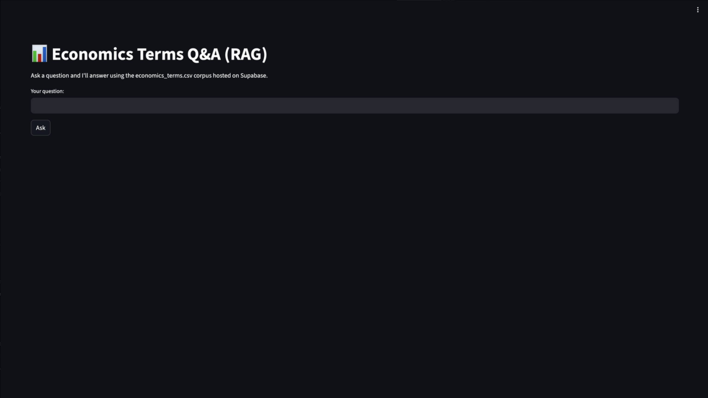
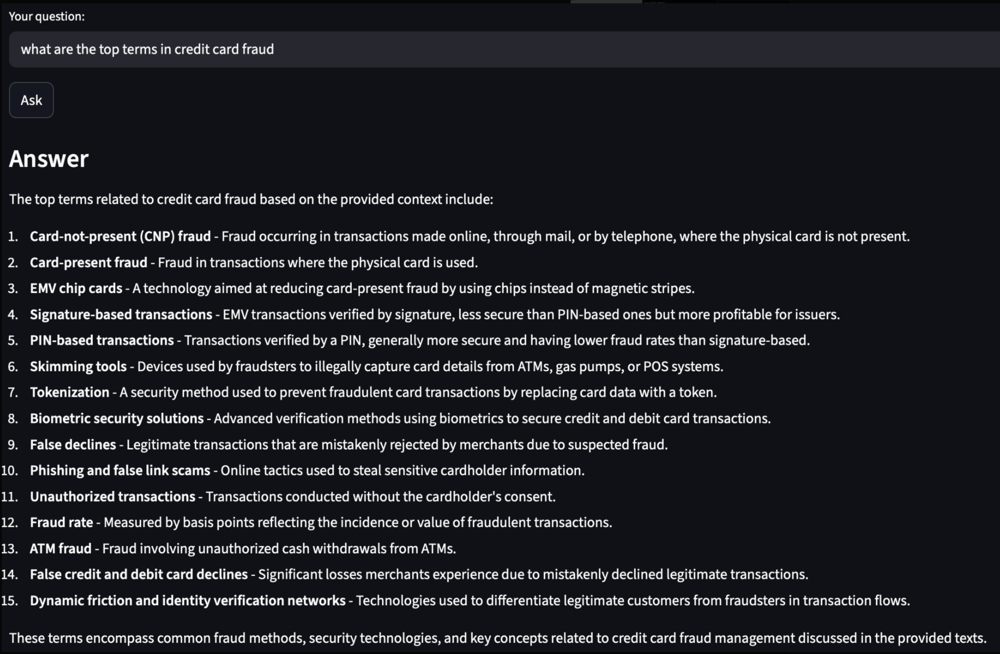
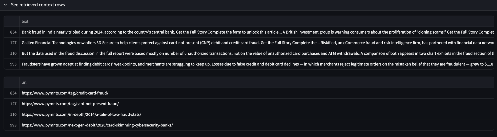
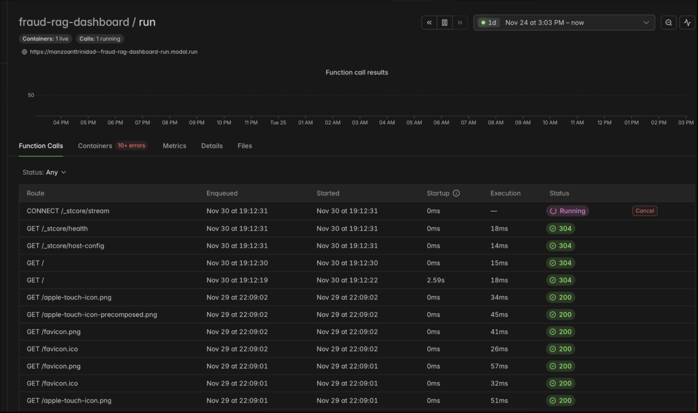

# **USAA Fraud News Intelligence Pipeline**  
*A Python + Streamlit system for scraping, summarizing, embedding, and querying fraud-related news articles for USAA Fraud Intelligence teams.*


---

# **1. 📌 Project Overview**

This class project invites UNC Charlotte students to develop Python-based tools capable of:

- Scraping fraud/scam-related news articles  
- Cleaning and extracting key fraud-related information  
- Generating AI summaries  
- Embedding article text into a vector database (Supabase)  
- Serving a **Streamlit RAG (Retrieval-Augmented Generation) App**  
- Enabling fraud analysts to ask natural-language questions like:  
  > “What fraud trends emerged this week?”  
  > “What scams are most common in banking?”  

USAA uses these insights to support:

- **State of Fraud Quarterly Reports**  
- **Weekly fraud intelligence updates**  
- **Executive briefings**  

This repo contains the complete pipeline + a working Streamlit UI.

---

# **2. ⚡ Quick Start**

## **Clone the Repo**
```bash
git clone https://github.com/manzoanttrinidad/USAA_Project
cd USAA_Project
```

## **Install Dependencies (uv)**
```bash
uv sync
```

## **Environment Variables**

Create your `.env` file:

```
OPENAI_API_KEY="your_key_here"
SUPABASE_URL="your_supabase_url"
SUPABASE_KEY="your_supabase_key"
```

Include a public template:

```
# example.env
OPENAI_API_KEY=""
SUPABASE_URL=""
SUPABASE_KEY=""
```

## **Run the Scraping Pipeline**
```bash
uv run scraper.py
```

## **Run the Streamlit App**
```bash
uv run streamlit run app.py
```

---

# **3. 🧩 Architecture & Application Design**

## **3.1 System Architecture (Mermaid Diagram)**

```mermaid
flowchart TD
    A[URL List CSV]
    B[Scraper(request - BeautifulSoup)]
    C[Raw Articles CSV]
    D[Cleaner & Keyword Extractor]
    E[LLM Summaries (OpenAI)]
    F[Embeddings (text-embedding-3-small)]
    G[Supabase Vector Store]
    H[Streamlit RAG App]
    I[User Fraud Questions]

    A --> B --> C --> D --> E --> F --> G --> H --> I
```

---

# **4. 📸 Visuals / Application Design**

## **4.1 Folder Structure**


Your project is structured cleanly around scraping, embedding, and serving results through Streamlit.

---

## **4.2 Streamlit App — Homepage**


Users can input natural-language fraud questions directly into the RAG interface.

---

## **4.3 RAG Answer Example**


A typical model response includes structured fraud insights, term definitions, and context.

---

## **4.4 Retrieved Context Rows**


These are the **top-k retrieved article excerpts** returned by the embedding similarity engine.

---

## **4.5 Modal Deployment Dashboard (Optional)**


This shows the deployed version of your app running live via Modal — with logs, function calls, uptime, and container health.

---

# **5. 🧪 What the Pipeline Does (with Code & Data Snippets)**

## **Scraping Example**
```python
def fetch_text(url):
    response = requests.get(url, timeout=10)
    soup = BeautifulSoup(response.text, "html.parser")
    return " ".join(p.text for p in soup.find_all("p"))
```

---

## **Raw Article Snippet**
| url | raw_text |
|-----|----------|
| https://news... | "POLICE WARN OF NEW PHONE SCAM..." |

---

## **Cleaning & Keyword Extraction**
```python
clean = raw.replace("\n", " ").strip()
keywords = extract_keywords(clean)
```

---

## **LLM Summarization**
```python
summary = client.chat.completions.create(
    model="gpt-4o-mini",
    messages=[{"role": "user", "content": clean_text}]
)
```

---

## **Embedding Generation**
```python
emb = client.embeddings.create(
    model="text-embedding-3-small",
    input=clean_text
).data[0].embedding
```

---

## **RAG Search Logic**
```python
scores = cosine_similarity(query_vec.reshape(1, -1), emb_matrix)[0]
top_k_idx = np.argsort(scores)[::-1][:4]
```

---

# **6. 🔍 Findings & Why This Matters**

This project outputs:

- A curated, cleaned, structured corpus of fraud-related news  
- Automatic AI summaries to reduce analyst workload  
- Embeddings that support semantic search & RAG  
- A UI that fraud teams can use immediately  

### **Example Fraud Trend Summary (Generated by the Model)**

| Scam Type | Frequency |
|-----------|-----------|
| Phishing | ██████████ |
| Banking Fraud | ███████ |
| Elder Fraud | ████ |
| Identity Theft | ███ |

### **Example RAG Result**
```
Q: What new scams appeared this month?

A: AI voice cloning fraud, “package intercept scams,” Zelle impersonation attacks, and government benefit redirection fraud are trending.
```

This system provides real-time fraud intelligence and saves analysts hours per week.

---

# **7. 📁 Full Folder Structure (Text Version)**

```bash
USAA_Project/
│
├── data/
│   ├── fraudish_urls.csv
│   ├── merged_fraudish_texts.csv
│   ├── merged_fraudish_with_embeddings.csv
│   ├── fraud_terms.csv
│   ├── ...
│
├── embeddings_cache.sqlite
├── embedding.py
├── scraper.py
├── rag_core.py
├── app.py
├── serve_streamlit.py
├── sitemap_pull.py
├── pyproject.toml
├── uv.lock
├── README.md
└── .env
```

---

# **8. 📜 License**

MIT License — feel free to reuse with attribution.

---

# **9. 👤 Authors**

**Anthony Manzo**  
UNC Charlotte  
USAA Fraud Intelligence Project  

**Nadia Narayanan**  
UNC Charlotte  
USAA Fraud Intelligence Project  

**Sabia Chowdhury**  
UNC Charlotte  
USAA Fraud Intelligence Project  

**AJ Clark**  
UNC Charlotte  
USAA Fraud Intelligence Project  

