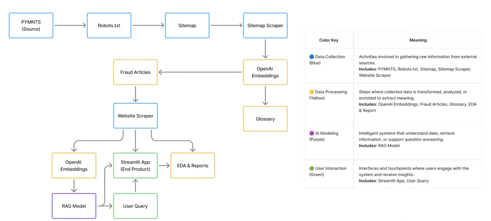

# **USAA Fraud News Intelligence Pipeline**  
*A Python + Streamlit system for scraping, summarizing, embedding, and querying fraud-related news articles for USAA Fraud Intelligence teams.*


---

# **1. 📌 Project Overview**

This class project invites UNC Charlotte students to develop Python-based tools capable of:

- Scraping fraud/scam-related news articles  
- Cleaning and extracting key fraud-related information  
- Generating AI summaries  
- Embedding article text into a vector database (Supabase)  
- Serving a **Streamlit RAG (Retrieval-Augmented Generation) App**  
- Enabling fraud analysts to ask natural-language questions like:  
  > “What fraud trends emerged this week?”  
  > “What scams are most common in banking?”  

USAA uses these insights to support:

- **State of Fraud Quarterly Reports**  
- **Weekly fraud intelligence updates**  
- **Executive briefings**  

This repo contains the complete pipeline + a working Streamlit UI.

---

# **2. ⚡ Quick Start**

## **Clone the Repo**
```bash
git clone https://github.com/manzoanttrinidad/USAA_Project
cd USAA_Project
```

## **Install Dependencies (uv)**
```bash
uv sync
```

## **Environment Variables**

Create your `.env` file:

```
OPENAI_API_KEY="your_key_here"
SUPABASE_URL="your_supabase_url"
SUPABASE_KEY="your_supabase_key"
```

Include a public template:

```
# example.env
OPENAI_API_KEY=""
SUPABASE_URL=""
SUPABASE_KEY=""
```

## **Run the Scraping Pipeline**
```bash
uv run scraper.py
```

## **Run the Streamlit App**
```bash
uv run streamlit run app.py
```

---

# **3. 🧩 Architecture & Application Design**

## **3.1 System Architecture (Made with Figma)**



---

# **4. 📸 Visuals / Application Design**

## **4.1 Folder Structure**


Your project is structured cleanly around scraping, embedding, and serving results through Streamlit.

---

## **4.2 Streamlit App — Homepage**


Users can input natural-language fraud questions directly into the RAG interface.

---

## **4.3 RAG Answer Example**


A typical model response includes structured fraud insights, term definitions, and context.

---

## **4.4 Retrieved Context Rows**


These are the **top-k retrieved article excerpts** returned by the embedding similarity engine.

---

## **4.5 Modal Deployment Dashboard **


This shows the deployed version of your app running live via Modal — with logs, function calls, uptime, and container health.

---

# **5. 🧪 What the Pipeline Does (with Code & Data Snippets)**

## **Scraping Example**
```python
def fetch_text(url):
    response = requests.get(url, timeout=10)
    soup = BeautifulSoup(response.text, "html.parser")
    return " ".join(p.text for p in soup.find_all("p"))
```

---

## **Raw Article Snippet**
| url | raw_text |
|-----|----------|
| https://news... | "POLICE WARN OF NEW PHONE SCAM..." |

---

## **Cleaning & Keyword Extraction**
```python
clean = raw.replace("\n", " ").strip()
keywords = extract_keywords(clean)
```

---

## **LLM Summarization**
```python
summary = client.chat.completions.create(
    model="gpt-4o-mini",
    messages=[{"role": "user", "content": clean_text}]
)
```

---

## **Embedding Generation**
```python
emb = client.embeddings.create(
    model="text-embedding-3-small",
    input=clean_text
).data[0].embedding
```

---

## **RAG Search Logic**
```python
scores = cosine_similarity(query_vec.reshape(1, -1), emb_matrix)[0]
top_k_idx = np.argsort(scores)[::-1][:4]
```

---

# **6. 🔍 Findings & Why This Matters**

This project outputs:

- A curated, cleaned, structured corpus of fraud-related news  
- Automatic AI summaries to reduce analyst workload  
- Embeddings that support semantic search & RAG  
- A UI that fraud teams can use immediately  

### **Example Fraud Trend Summary (Generated by the Model)**

| Scam Type | Frequency |
|-----------|-----------|
| Phishing | ██████████ |
| Banking Fraud | ███████ |
| Elder Fraud | ████ |
| Identity Theft | ███ |

### **Example RAG Result**
```
Q: What new scams appeared this month?

A: AI voice cloning fraud, “package intercept scams,” Zelle impersonation attacks, and government benefit redirection fraud are trending.
```

This system provides real-time fraud intelligence and saves analysts hours per week.

---

# **7. 📁 Full Folder Structure (Text Version)**

```bash
USAA_Project/
│
├── data/
│   ├── fraudish_urls.csv
│   ├── merged_fraudish_texts.csv
│   ├── merged_fraudish_with_embeddings.csv
│   ├── fraud_terms.csv
│   ├── ...
│
├── embeddings_cache.sqlite
├── embedding.py
├── scraper.py
├── rag_core.py
├── app.py
├── serve_streamlit.py
├── sitemap_pull.py
├── pyproject.toml
├── uv.lock
├── README.md
└── .env
```

---
# **8.
Report on the Evolving Landscape of Fraud in the Digital Age
I. Introduction Fraud in the financial sector is undergoing rapid evolution, driven by technological advancements and changing tactics employed by fraudsters. While some positive trends have emerged, such as a decline in overall fraud rates in certain periods, the landscape presents significant challenges with new forms of fraud increasing sharply. This report explores the multifaceted nature of this evolving fraud environment, the impact on financial technology (FinTech) firms and financial institutions (FIs), and the critical role of advanced technologies in combating fraud.
II. Trends in Fraud Incidence and Impact
A. Decline in Overall Fraud Rates Amid Rising New Forms Recent data indicate that, in 2022, fraud rates reached their lowest levels since 2014, affecting 65% of organizations. This decline suggests that efforts to combat traditional fraud have seen some success. However, emerging fraud types exhibit alarming growth rates:
FinTech fraud increased by 13% in 2022.
Digital goods and services fraud rose by 27%.
Cryptocurrency exchange fraud surged by 45%.
Buy Now, Pay Later (BNPL) fraud escalated by an unprecedented 211%.
These figures demonstrate that while some areas show improvement, others are experiencing heightened vulnerability.
B. Identity Fraud as a Critical Threat Identity fraud remains a significant concern, particularly within the FinTech sector. Nearly half of all FinTech companies have been impacted by fraud involving fake documents and synthetic identities crafted from stolen credentials. The creation of synthetic identities challenges traditional fraud detection systems, allowing fraudsters to bypass defenses with false identities that appear legitimate.
C. Increasing Sophistication of Fraud Tactics Fraudsters are leveraging advanced technologies and methodologies, including:
The use of "fraud-as-a-service" offerings on the dark web, enabling criminals to purchase sophisticated tools and automated scripts that can mass-produce fraudulent activities.
Employment of artificial intelligence (AI) tools such as ChatGPT to craft highly convincing fraudulent communications free from grammatical errors, raising the difficulty in detecting scams.
Marketing techniques such as segmentation, personalization, and optimized timing to enhance the effectiveness of fraudulent attacks.
III. Impact on Financial Institutions and Consumers
A. Financial Institutions’ Challenges Financial institutions face escalating losses as fraud attacks increase in number and complexity. Notably, FIs with assets exceeding $5 billion have reported a 65% rise in fraud-related costs. Account takeovers (ATOs) and misuse of account information remain prevalent, accounting for significant shares of fraudulent transactions.
B. Consumer Consequences The human toll includes stress, anxiety, and financial losses, with many victims experiencing prolonged uncertainty and hardship due to the difficulty in recovering stolen funds. Peer-to-peer platform users report severe financial exploitation losses, often exceeding thousands of dollars.
IV. Technological Responses and Strategies

A. Investment in Advanced Fraud Prevention Financial institutions and merchants are substantially increasing investment in fraud prevention technologies, sometimes spending up to 40% more on prevention efforts than their fraud losses. The deployment of AI and machine learning (ML) has become central to these efforts.
B. Effectiveness of AI and ML Solutions AI and ML-powered solutions offer proactive and automated detection capabilities,:
Reducing fraud losses by approximately half compared to firms using manual or legacy systems.
Enhancing behavioral analytics to identify anomalies and unauthorized activities.
Lowering false positive rates, thereby reducing customer friction and abandonment.
Accelerating investigation times by up to 70% and improving detection accuracy by 90%.
C. Shift Toward In-House Systems There is a marked trend among large financial institutions to develop new in-house fraud detection systems instead of relying on traditional outsourcing. This move reflects confidence in proprietary, AI-driven solutions tailored to the institution’s specific needs.
V. Conclusion
The evolving digital fraud landscape presents a double-edged sword: while technological advancements facilitate innovative fraud prevention measures, they equally empower fraudsters with tools to conduct more sophisticated and large-scale attacks. Despite successes in reducing certain fraud rates, the sharp rise in new fraudulent activities—especially in FinTech, digital goods, cryptocurrency, and BNPL sectors—demonstrates the urgent need for continuous vigilance and adaptation.

Financial institutions and merchants must embrace advanced, AI- and ML-powered solutions and invest in ongoing innovation to stay ahead of fraudsters. The future fight against fraud will depend on the ability to integrate cutting-edge technology seamlessly with robust human oversight, ensuring high accuracy in detection and maintaining consumer trust and safety in an increasingly digital financial ecosystem.

# **9. 📜 License**

MIT License — feel free to reuse with attribution.

---

# **10. 👤 Authors**

**Anthony Manzo**  
UNC Charlotte  
USAA Fraud Intelligence Project  

**Nadia Narayanan**  
UNC Charlotte  
USAA Fraud Intelligence Project  

**Sabia Chowdhury**  
UNC Charlotte  
USAA Fraud Intelligence Project  

**AJ Clark**  
UNC Charlotte  
USAA Fraud Intelligence Project  

